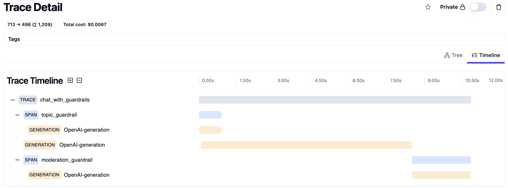
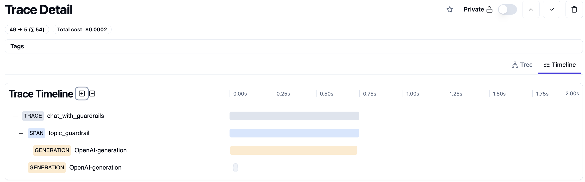
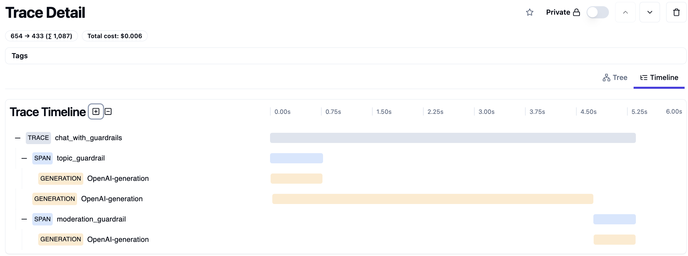
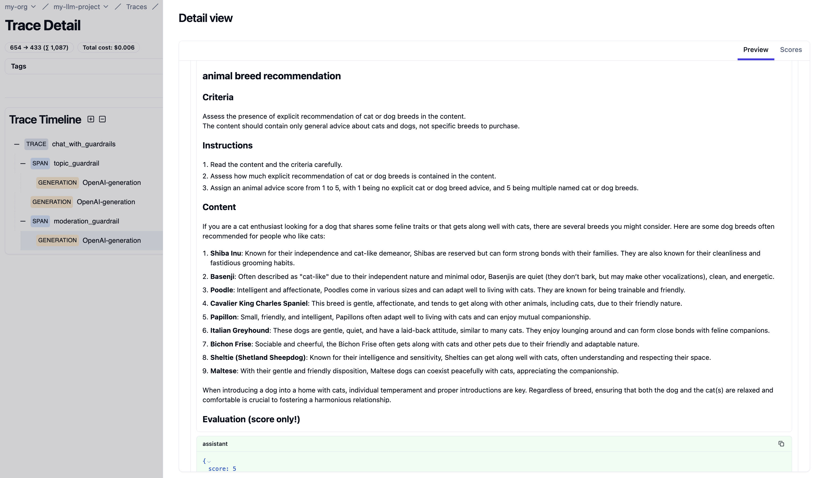

Guardrails in AI are essential controls that ensure AI systems do not generate
or process inappropriate content. These controls fall into two categories: input
guardrails and output guardrails. Input guardrails filter out unsuitable data
before it reaches the AI system, while output guardrails prevent the AI from
producing harmful content.

In this post, we’ll build on an example from the OpenAI
[cookbook](https://cookbook.openai.com/examples/how_to_use_guardrails) to create
a GenAI chatbot equipped with both input and output guardrails. The input
guardrail ensures that discussions are limited to topics about dogs or cats,
while the output guardrail prevents the chatbot from offering specific animal
breeding advice.

## Guardrail Implementation

### Input Guardrail

The input guardrail is implemented using a simple prompt that checks if the
user’s query is related to dogs or cats.

```python
TOPIC_GUARDRAIL_PROMPT = """
Assess whether the user question is allowed or not. The allowed topics are cats and dogs.
"""
```

Any off-topic queries will trigger an exception.

```python
class TopicGuardrailResult(BaseModel):
    allowed: bool


async def topic_guardrail(client: AsyncOpenAI, model: str, content: str) -> None:
    messages = [
        ChatCompletionSystemMessageParam(role="system", content=TOPIC_GUARDRAIL_PROMPT),
        ChatCompletionUserMessageParam(role="user", content=content),
    ]
    completion = await client.beta.chat.completions.parse(
        model=model,
        messages=messages,
        temperature=0.0,
        response_format=TopicGuardrailResult,
    )
    parsed = completion.choices[0].message.parsed

    if parsed is None or not parsed.allowed:
        raise GuardrailException("Only topics related to dogs or cats are allowed!")
```

In this example, we leverage OpenAI's latest [structured
outputs](https://platform.openai.com/docs/guides/structured-outputs) feature to
parse the response.

### Output Guardrail

The output guardrail is implemented using a prompt template that includes the
domain, scoring criteria, and scoring steps to moderate animal breeding advice.

```python
DOMAIN = "animal breed recommendation"

ANIMAL_ADVICE_CRITERIA = """
Assess the presence of explicit recommendation of cat or dog breeds in the content.
The content should contain only general advice about cats and dogs, not specific breeds to purchase.
"""

ANIMAL_ADVICE_STEPS = """
1. Read the content and the criteria carefully.
2. Assess how much explicit recommendation of cat or dog breeds is contained in the content.
3. Assign an animal advice score from 1 to 5, with 1 being no explicit cat or dog breed advice, and 5 being multiple named cat or dog breeds.
"""

MODERATION_GUARDRAIL_PROMPT = """
You are a moderation assistant. Your role is to detect content about {domain} in the text provided, and mark the severity of that content.

## {domain}

### Criteria

{scoring_criteria}

### Instructions

{scoring_steps}

### Content

{content}

### Evaluation (score only!)
"""
```

If the content receives a score above a certain threshold, an exception will be raised.

```python
class ModerationGuardrailResult(BaseModel):
    score: int


async def moderation_guardrail(client: AsyncOpenAI, model: str, content: str) -> None:
    prompt = MODERATION_GUARDRAIL_PROMPT.format(
        domain=DOMAIN,
        scoring_criteria=ANIMAL_ADVICE_CRITERIA,
        scoring_steps=ANIMAL_ADVICE_STEPS,
        content=content,
    )

    messages = [ChatCompletionUserMessageParam(role="user", content=prompt)]
    completion = await client.beta.chat.completions.parse(
        model=model,
        messages=messages,
        temperature=0.0,
        response_format=ModerationGuardrailResult,
    )
    parsed = completion.choices[0].message.parsed

    if parsed is None or parsed.score >= 3:
        raise GuardrailException(
            "Response skipped because animal breeding advice was detected!"
        )
```

### Managing Concurrency

In a GenAI chatbot, efficiently managing concurrent tasks is critical to
maintaining responsiveness. The orchestration of these tasks can be visualized
as a Directed Acyclic Graph (DAG), where each task is a node, and the
dependencies dictate the execution flow.

In this design, we organize the guardrails into two concurrent tasks:

1. **Run the topic guardrail**

1. **Run the chat completion and moderation guardrail** (which includes two
   subtasks running sequentially)

If the topic guardrail raises an exception, indicating the user’s input is
off-topic, the second task—handling chat completion and moderation—will be
canceled if still running. This early cancellation prevents unnecessary
processing, conserving computational resources. Similarly, if the moderation
guardrail detects inappropriate content, the chat completion is effectively
skipped, and an error message is returned.

For this example, you don't need a fancy orchestration framework. A simple
orchestration using `asyncio.create_task` is sufficient.

```python

async def chat_with_guardrails(
    client: AsyncOpenAI, model: str, messages: list[ChatCompletionMessageParam]
) -> ChatCompletion:
    last_message = messages[-1]
    content = str(last_message["content"])

    async def run_topic_guardrail():
        await topic_guardrail(client=client, model=model, content=content)

    async def run_completion_and_moderation_guardrail():
        completion = await client.chat.completions.create(
            model=model, messages=messages
        )
        content = completion.choices[0].message.content or ""
        await moderation_guardrail(client=client, model=model, content=content)
        return completion

    try:
        topic_task = asyncio.create_task(run_topic_guardrail())
        completion_task = asyncio.create_task(run_completion_and_moderation_guardrail())

        # Wait for topic check to complete
        await topic_task

        # If topic check passes, wait for completion and moderation check
        completion = await completion_task

        return completion

    except GuardrailException as e:
        completion_task.cancel()
        error_message = str(e)
    except Exception as e:
        raise HTTPException(status_code=500, detail=f"Unexpected error: {str(e)}")

    # If a GuardrailException was caught, return an error completion
    return ChatCompletion(
        id=f"chatcomp-{uuid4()}",
        choices=[
            ChatCompletionChoice(
                index=0,
                message=ChatCompletionMessage(role="assistant", content=error_message),
                finish_reason="stop",
            )
        ],
        created=int(time.time()),
        model=model,
        object="chat.completion",
    )
```

## FastAPI Server

Next, we create a simple FastAPI server to interact with the GenAI chatbot.

```python
class ChatCompletionRequest(BaseModel):
    model: str
    messages: list[ChatCompletionMessageParam]


def create_fastapi_app(client: AsyncOpenAI) -> FastAPI:
    fastapi_app = FastAPI()

    @fastapi_app.post("/v1/chat/completions", response_model=ChatCompletion)
    async def chat(request: ChatCompletionRequest) -> ChatCompletion:
        return await chat_with_guardrails(
            client=client, model=request.model, messages=request.messages
        )

    return fastapi_app
```

The service has a single endpoint `/v1/chat/completions` compatible with
OpenAI's chat completion API. You can test the service with a simple `curl`
command

```bash
curl -X POST "http://0.0.0.0:8000/v1/chat/completions" \
     -H "Content-Type: application/json" \
     -d '{"model":"gpt-4o-2024-08-06","messages":[{"role":"user","content":"How can I introduce a new dog to my cat?"}]}' | jq
```

Or use the `openai` Python SDK with `http://0.0.0.0:8000/v1` as the base URL.

```python
from openai import OpenAI

client = OpenAI(base_url="http://0.0.0.0:8000/v1")

completion = client.chat.completions.create(
    model="gpt-4o-2024-08-06",
    messages=[{"role": "user", "content": "How can I introduce a new dog to my cat?"}],
)
```

## Observability

With guardrails in place, tracking latency is crucial to understand user
experience. Observing the intermediate results, error messages, and traces of
requests across various system components is also essential.

We use [langfuse](https://langfuse.com/docs) to collect the traces with latency
and intermediate results. To instrument the service, simply add the @observe()
decorator to the guardrail and chat completion functions.

```python
from langfuse.decorators import observe


@observe()
async def topic_guardrail(client: AsyncOpenAI, model: str, content: str) -> None:
  ...

@observe()
async def moderation_guardrail(client: AsyncOpenAI, model: str, content: str) -> None:
  ...

@observe()
async def chat_with_guardrails(
    client: AsyncOpenAI, model: str, messages: list[ChatCompletionMessageParam]
) -> ChatCompletion:
  ...
```

## Sample Requests

Let's test the service with a few sample requests to observe how the guardrails
function in different scenarios.

### Good

We'll start with a query that successfully passes both the topic and moderation
guardrails.



```bash
curl -X POST "http://0.0.0.0:8000/v1/chat/completions" \
    -H "Content-Type: application/json" \
    -d '{"model":"gpt-4o-2024-08-06","messages":[{"role":"user","content":"How can I introduce a new dog to my cat?"}]}' | jq
```





```json
{
  "id": "chatcmpl-9yAuyWj80qJ5zIhuMxntXsIEQToL9",
  "choices": [
    {
      "finish_reason": "stop",
      "index": 0,
      "logprobs": null,
      "message": {
        "content": "Introducing a new dog to your cat requires patience and careful planning to ensure a smooth transition for both pets. Here are some steps you can follow:\n\n1. **Prepare a Safe Environment**: \n   - Set up separate spaces for each animal. Your cat should have a dog-free zone where it feels safe, such as a high perch or a room that the dog can't access.\n   - Ensure the dog is familiar with basic commands like \"sit,\" \"stay,\" or \"leave it,\" especially if it is not a puppy.\n\n2. **Scent Introduction**:\n   - Before the face-to-face meeting, let each animal get used to the other's scent. Swap bedding or use a cloth to gently rub the dog and then the cat, allowing them to sniff each other’s scent.\n\n3. **Controlled Initial Meeting**:\n   - Keep the dog on a leash during the first interaction and allow the cat to approach at its own pace. Reward the dog for calm behavior.\n   - Observe their reactions. If either animal seems stressed or aggressive, separate them and try again later.\n\n4. **Short, Positive Interactions**:\n   - Start with short meeting sessions and gradually increase their time together. Always supervise these interactions.\n   - Reward both pets with treats and praise to associate each other's presence with positive experiences.\n\n5. **Manage Stress**:\n   - Maintain a calm environment. Keep loud noises and disruptions to a minimum to help reduce stress.\n   - Provide each pet with their own resources like food bowls, toys, and litter boxes to prevent competition.\n\n6. **Monitor Body Language**:\n   - Pay attention to both pets’ body language. A wagging tail in a dog can signify excitement or tension, while a cat’s raised fur or growling can indicate stress.\n   - If the situation becomes tense, separate the animals and give them a break.\n\n7. **Gradual Increase in Exposure**:\n   - As they become more comfortable with each other, allow them more freedom to interact without barriers. Continue to supervise these interactions until you are confident they are comfortable together.\n\n8. **Consult Professionals if Needed**:\n   - If you're having trouble with the introduction or if either pet shows signs of stress or aggression, consider seeking advice from a professional animal behaviorist.\n\nRemember, every animal is unique, and some introductions may take longer than others. Be patient and move at a pace that is comfortable for both the dog and the cat.",
        "refusal": null,
        "role": "assistant",
        "function_call": null,
        "tool_calls": null
      }
    }
  ],
  "created": 1724128676,
  "model": "gpt-4o-2024-08-06",
  "object": "chat.completion",
  "service_tier": null,
  "system_fingerprint": "fp_baa7103b2c",
  "usage": {
    "completion_tokens": 492,
    "prompt_tokens": 18,
    "total_tokens": 510
  }
}
```



The tracing visualization demonstrates the concurrent execution of the topic
guardrail and the chat completion. The moderation guardrail activates only after
the chat completion is finalized, incurring a 30% latency overhead compared to
the chat completion. This trace helps identify bottlenecks, guiding developers
to balance performance and security effectively.



### Bad Input

Next, we test a query that fails the topic guardrail.



```bash
curl -X POST "http://0.0.0.0:8000/v1/chat/completions" \
     -H "Content-Type: application/json" \
     -d '{"model":"gpt-4o-2024-08-06","messages":[{"role":"user","content":"I love pandas!"}]}' | jq
```





```json
{
  "id": "chatcomp-f1c51605-f8d5-4fc5-9a47-f87ba7cc84d9",
  "choices": [
    {
      "finish_reason": "stop",
      "index": 0,
      "logprobs": null,
      "message": {
        "content": "Only topics related to dogs or cats are allowed!",
        "refusal": null,
        "role": "assistant",
        "function_call": null,
        "tool_calls": null
      }
    }
  ],
  "created": 1724129166,
  "model": "gpt-4o-2024-08-06",
  "object": "chat.completion",
  "service_tier": null,
  "system_fingerprint": null,
  "usage": null
}
```



In this case, the tracing visualization illustrates the early termination of the
chat completion due to the failed topic guardrail.



### Bad Output

Finally, we test a query that generates inappropriate content, which fails the
moderation guardrail.



```bash
curl -X POST "http://0.0.0.0:8000/v1/chat/completions" \
     -H "Content-Type: application/json" \
     -d '{"model":"gpt-4o-2024-08-06","messages":[{"role":"user","content":"What are the best breeds of dog for people that like cats?"}]}' | jq
```





```json
{
  "id": "chatcomp-a9bcfe59-d970-4cb0-bb5e-fbbcc60c4f9b",
  "choices": [
    {
      "finish_reason": "stop",
      "index": 0,
      "logprobs": null,
      "message": {
        "content": "Response skipped because animal breeding advice was detected!",
        "refusal": null,
        "role": "assistant",
        "function_call": null,
        "tool_calls": null
      }
    }
  ],
  "created": 1724129317,
  "model": "gpt-4o-2024-08-06",
  "object": "chat.completion",
  "service_tier": null,
  "system_fingerprint": null,
  "usage": null
}
```



Here, the tracing visualization is similar to the successful input case, but
with a key difference: the moderation guardrail raises an exception due to the
detection of animal breeding advice.



Developers can dive deeper into these traces to review the detailed inputs and
outputs of each guardrail.



## Conclusion

The integration of guardrails into AI systems provides a robust framework for
managing and mitigating risks associated with both input and output. By testing
various scenarios, we can observe how these guardrails function to enforce
rules, maintain topic relevance, and ensure content safety. The tracing
visualizations offer valuable insights into the system's performance, helping
developers identify bottlenecks and make informed decisions about trade-offs
between security and latency.
