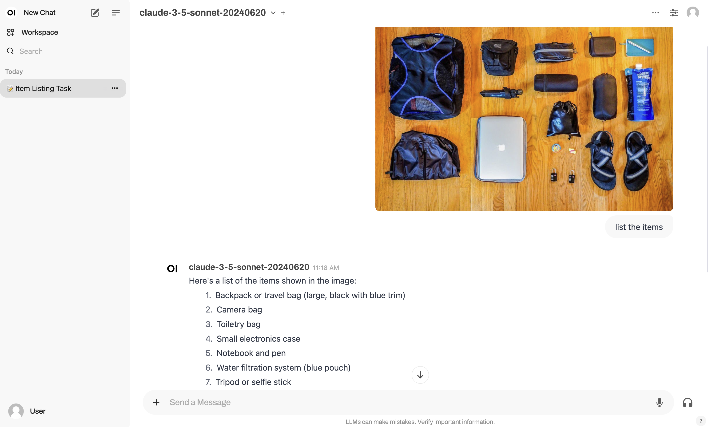

When it comes to code generation and critique, I've found Anthropic's models to be my top choice. In
my experience, they consistently deliver higher quality outputs compared to OpenAI's GPT-4.
Claude.ai, the official WebUI for Anthropic models, provides a streamlined interface for interacting
with these models. However, it has a significant drawback: strict rate limits that can be quickly
reached.

To overcome this rate limit of claude.ai or chatgpt.com, many developers turn to open-source
solutions. [Open WebUI](https://docs.openwebui.com/) is a popular choice for OpenAI and Ollama
models, but it doesn't natively support Anthropic models. This doesn't mean we're out of options. In
this post, I'll walk you through a solution to integrate Anthropic models with Open WebUI.

## Building a Proxy Server

Since Open WebUI supports OpenAI models, we can create a proxy server that translates OpenAI chat
completion requests into Anthropic message requests and then converts the responses back to the
OpenAI format. Essentially, the proxy server acts as a bridge between Open WebUI and Anthropic's
models.

To achieve this, we need to implement three key endpoints in the proxy server:

- **Health check endpoint** (`/v1`): This endpoint ensures that the proxy server is up and running.
  Open WebUI periodically pings it to confirm server availability.

- **Model listing endpoint** (`/v1/models`): This endpoint lists the models accessible to the
  server. Open WebUI uses this information to populate its model selection dropdown.

- **Chat completion endpoint** (`/v1/chat`): This endpoint handles chat completions and must support
  both non-streaming and streaming responses:

  - **Non-Streaming**: This mode generates a conversation title based on the initial user message,
    which Open WebUI displays in a side panel for easy navigation of conversation history.

  - **Streaming**: This mode streams responses back to the user in chunks as they are generated,
    mimicking the experience on claude.ai or chatgpt.com.

Below is an example implementation of these endpoints using FastAPI:

```python
def create_app(client: AsyncAnthropic) -> FastAPI:
    app = FastAPI()

    @app.get("/v1")
    async def health() -> dict[str, Any]:
        return {"status": True}

    @app.get("/v1/models")
    async def models() -> dict[str, Any]:
        return MODELS

    @app.post("/v1/chat/completions")
    async def chat(request: ChatCompletionRequest) -> Any:
        if request.stream:
            # Streaming when responding to user messages
            stream_content = await create_chat_completion_stream(
                client=client,
                model=request.model,
                messages=request.messages,
            )
            return StreamingResponse(
                content=stream_content, media_type="text/event-stream"
            )

        # Non-streaming when creating titles for conversations
        completion = await create_chat_completion(
            client=client,
            model=request.model,
            messages=request.messages,
        )
        return Response(
            content=completion.model_dump_json(), media_type="application/json"
        )

    return app
```

The `create_chat_completion` and `create_chat_completion_stream` functions encapsulate the core
logic for generating chat completions in non-streaming and streaming modes, respectively.

```python
async def create_chat_completion(
    client: AsyncAnthropic,
    model: str,
    messages: list[ChatCompletionMessageParam],
) -> ChatCompletion:
    message = await client.messages.create(
        max_tokens=4096, messages=messages, model=model
    )
    completion = ChatCompletion(
        id=message.id,
        choices=[
            ChatCompletionChoice(
                index=0,
                message=ChatCompletionMessage(
                    content=message.content[0].text, role="assistant"
                ),
                finish_reason="stop",
            )
        ],
        created=int(time.time()),
        model=model,
        object="chat.completion",
    )
    return completion


async def create_chat_completion_stream(
    client: AsyncAnthropic,
    model: str,
    messages: list[ChatCompletionMessageParam],
) -> AsyncIterator[str]:
    async def stream_content() -> AsyncIterator[str]:
        async with client.messages.stream(
            max_tokens=4096,
            messages=messages,
            model=model,
        ) as stream:
            async for text in stream.text_stream:
                chunk = ChatCompletionChunk(
                    id=f"msg-{uuid.uuid4()}",
                    choices=[Choice(index=0, delta=ChoiceDelta(content=text))],
                    created=int(time.time()),
                    model=model,
                    object="chat.completion.chunk",
                )
                yield f"data: {chunk.model_dump_json()}\n\n"

            # Send a final chunk to indicate the stream has ended
            chunk = ChatCompletionChunk(
                id=f"msg-{uuid.uuid4()}",
                choices=[Choice(index=0, delta=ChoiceDelta(), finish_reason="stop")],
                created=int(time.time()),
                model=model,
                object="chat.completion.chunk",
            )
            yield f"data: {chunk.model_dump_json()}\n\n"

    return stream_content()
```

To run the proxy server, instantiate AsyncAnthropic with your Anthropic API key:

```python
def main(argv: Any) -> None:
    del argv  # Unused

    client = AsyncAnthropic(api_key=os.environ.get("ANTHROPIC_API_KEY"))
    fastapi_app = create_app(client=client)
    uvicorn.run(
        fastapi_app,
        host="0.0.0.0",
        port=FLAGS.port,
        use_colors=True,
    )
```

## Configuring Open WebUI

To connect the proxy server to Open WebUI, you'll need to configure two environment variables within
the Open WebUI Docker container:

- `OPENAI_API_BASE_URL`: Set this to the proxy server's address. If the proxy server is running
  locally, use http://localhost:8000/v1.

- `OPENAI_API_KEY`: Assign any arbitrary value to this variable. Open WebUI requires this
  environment variable, but the actual API key isn't used.

After setting these variables, start the Open WebUI container alongside the proxy server. Once
everything is up and running, head over to http://localhost:3000 in your browser. You should now see
Anthropic models listed in the model selection dropdown, allowing you to leverage their capabilities
directly within Open WebUI.


You can also upload an image file and use Anthropic models' vision capability to understand and
analyze image content.



## Wrapping Up

With a bit of ingenuity, we've successfully integrated Anthropic models into Open WebUI. This setup
provides a flexible and cost-effective alternative to the subscription-based Pro version of
Claude.ai, offering enhanced functionality without the typical rate limit constraints.

For those interested in exploring further, the full source code is available at
https://github.com/wangxj03/ai-cookbook/tree/main/anthropic-webui.

Happy coding!
