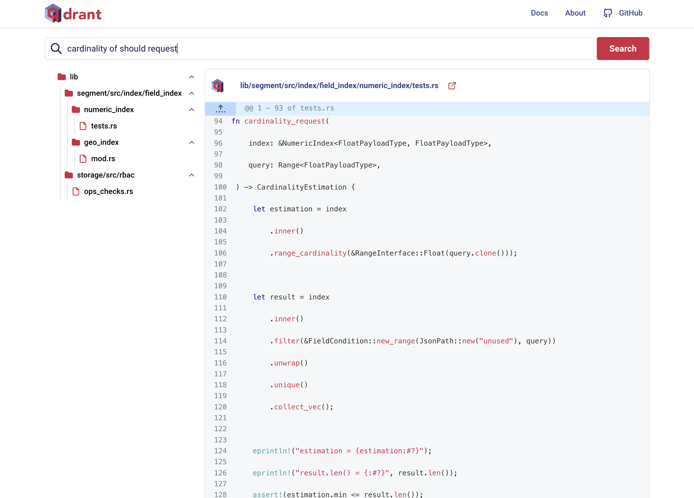

There’s been a lot of buzz lately about Cursor, particularly its [codebase indexing](https://docs.cursor.com/context/codebase-indexing) feature. This feature turns Cursor into a context-aware coding assistant. But how does it work, and can we build something similar? Let's dive in.

## Understanding Cursor's Magic

Cursor's codebase indexing, as explained in this [forum post](https://forum.cursor.com/t/codebase-indexing/36), works as follows:

1. It chunks your codebase files locally.

1. These chunks are then sent to Cursor's server, where embeddings are created using either OpenAI's embedding API or a custom embedding model.

1. The embeddings, along with start/end line numbers and file paths, are stored in a remote vector database.

When you use @Codebase or ⌘ Enter to ask about your codebase, Cursor retrieves relevant code chunks from this database to provide context for large language model (LLM) calls. In essence, Cursor employs a Retrieval-Augmented Generation (RAG) model, with the codebase index acting as the retrieval mechanism.

## Building Our Own Semantic Code Search

Inspired by Cursor and Qdrant’s [code search demo](https://github.com/qdrant/demo-code-search/tree/master), we'll replicate the codebase indexing feature and use it to power a semantic code search application. This application includes two main components:

1. An offline ingestion pipeline to index code embeddings into a vector database

1. A code search server for semantic retrieval from this database

Let's break down each component and explore how we can implement them.

## Ingestion Pipeline

Our ingestion pipeline involves three crucial steps: splitting source code, creating embeddings, and indexing them in a vector database.

### Why Split Source Code?

Splitting source code files serves two primary purposes:

1. **Overcoming Model Input Limits**: Embedding models have token limits. OpenAI's [text-embedding-3-small](https://platform.openai.com/docs/guides/embeddings) model, for example, has a token limit of 8192. Splitting ensures we stay within these bounds.

2. **Enhancing Semantic Granularity**: Smaller chunks offer more precise semantic understanding. By focusing on specific parts of the code, we improve retrieval relevance and quality.

#### Splitting Strategies

While you could split code based on characters, words, or lines, a more sophisticated approach is to split based on tokens. We'll use [tiktoken](https://github.com/openai/tiktoken), a fast Byte Pair Encoding (BPE) tokenizer compatible with OpenAI models.

A naive strategy is to split code based on a fixed token count, but this can cut off code blocks like functions or classes mid-way. A more effective approach is to use an intelligent splitter that understands code structure, such as Langchain's [recursive text splitter](https://python.langchain.com/docs/how_to/recursive_text_splitter/). This method uses high-level delimiters (e.g., class and function definitions) to split at the appropriate semantic boundaries. However, this approach is language-specific and can struggles with languages that use curly braces for block delimitation.

A even more elegant solution is to split the code based on its Abstract Syntax Tree (AST) structure, as outlined in this [blog post](https://docs.sweep.dev/blogs/chunking-2m-files). By traversing the AST depth-first, it splits code into sub-trees that fit within the token limits. To avoid creating too many small chunks, sibling nodes are merged into larger chunks as long as they stay under the token limit. LlamaIndex offers a clean Python implementation in its [CodeSplitter](https://docs.llamaindex.ai/en/v0.10.19/api/llama_index.core.node_parser.CodeSplitter.html) function. Both implementations use [tree-sitter](https://crates.io/crates/tree-sitter) for AST parsing, which supports a wide range of languages.

We use [code-splitter](https://github.com/wangxj03/code-splitter) (shameless plug: I'm the author!), a Rust re-implementation for added efficiency. Here is anan example of using its [Python bindings](https://pypi.org/project/code-splitter/) to split Rust files in a directory:

```python
from code_splitter import Language, TiktokenSplitter

def walk(dir: str, max_size: int) -> Generator[dict[str, Any], None, None]:
    splitter = TiktokenSplitter(Language.Rust, max_size=max_size)

    for root, _, files in os.walk(dir):
        for file in files:
            if not file.endswith(".rs"):
                continue

            file_path = os.path.join(root, file)
            rel_path = os.path.relpath(file_path, dir)

            with open(file_path, mode="r", encoding="utf-8", errors="ignore") as f:
                lines = f.readlines()

            with open(file_path, mode="rb") as f:
                code = f.read()
                chunks = splitter.split(code)

                for chunk in chunks:
                    yield {
                        "file_path": rel_path,
                        "file_name": file,
                        "start_line": chunk.start,
                        "end_line": chunk.end,
                        "text": "\n".join(lines[chunk.start : chunk.end]),
                        "size": chunk.size,
                    }
```

### Creating Embeddings

Qdrant's authors used the open-source [all-MiniLM-L6-v2](https://huggingface.co/sentence-transformers/all-MiniLM-L6-v2) embedding model in their demo. Since this model is primarily trained on natural language tasks, they created a synthetic text-like representation of the code and passed it to the model. The representation captures key elements like function names, signatures, and docstrings.

We opted to use OpenAI’s [text-embedding-3-small](https://platform.openai.com/docs/guides/embeddings) model. While not specifically trained on code, it performs reasonably well on code-related tasks. For those seeking more specialized alternatives, consider Microsoft’s [unixcoder-base](https://huggingface.co/microsoft/unixcoder-base) or Voyage AI’s [voyage-code-2](https://blog.voyageai.com/2024/01/23/voyage-code-2-elevate-your-code-retrieval/) which provides a much larger token limit.

### Indexing

To index the code chunk embeddings, we'll use [Qdrant](https://github.com/qdrant/qdrant) as in the original demo. Qdrant is an open-source vector database written in Rust and is optimized to handle high-dimensional vectors at scale. Here's how we index our embeddings along with metadata such as file paths, start/end line numbers, and chunk sizes. This metadata enables the frontend to display relevant information during search results.

```python
import pandas as pd
from qdrant_client import QdrantClient
from qdrant_client.models import Distance, PointStruct, VectorParams

df = pd.read_parquet("/data/code_embeddings.parquet")

client = QdrantClient("http://localhost:6333")

client.recreate_collection(
    collection_name="qdrant-code",
    vectors_config=VectorParams(size=1536, distance=Distance.COSINE),
)

points = [
    PointStruct(
        id=idx,
        vector=row["embedding"].tolist(),
        payload=row.drop(["embedding"]).to_dict(),
    )
    for idx, row in df.iterrows()
]

client.upload_points("qdrant-code", points)
```

We'll also index entire code files in a separate Qdrant collection, enabling full-file retrieval during search results.

## Semantic Code Search

With our Qdrant database populated with code chunk embeddings and metadata, we can now build a code search server. Here's the architecture of our search application:


The backend, built with [FastAPI](https://github.com/fastapi/fastapi), handles REST requests and interacts with the Qdrant vector database. It exposes two endpoints:

- **`GET /api/search`**: Search for code snippets based on a query.
- **`GET /api/file`**: Fetch the full content of a file based on its path.

For the frontend, we'll reuse the [React code](https://github.com/qdrant/demo-code-search/blob/master/frontend) from Qdrant's demo. Below is an example of what a query might look like in the UI:



## Wrapping Up

We've successfully built a semantic code search application that mirrors Cursor's codebase indexing functionality. This solution offers full control over each component—from code splitting and embedding generation to vector database indexing and search server implementation.

Ready to dive deeper? Check out the complete source code on GitHub:
https://github.com/wangxj03/ai-cookbook/tree/main/code-search

Happy coding, and may your semantic searches always find what you're looking for!
