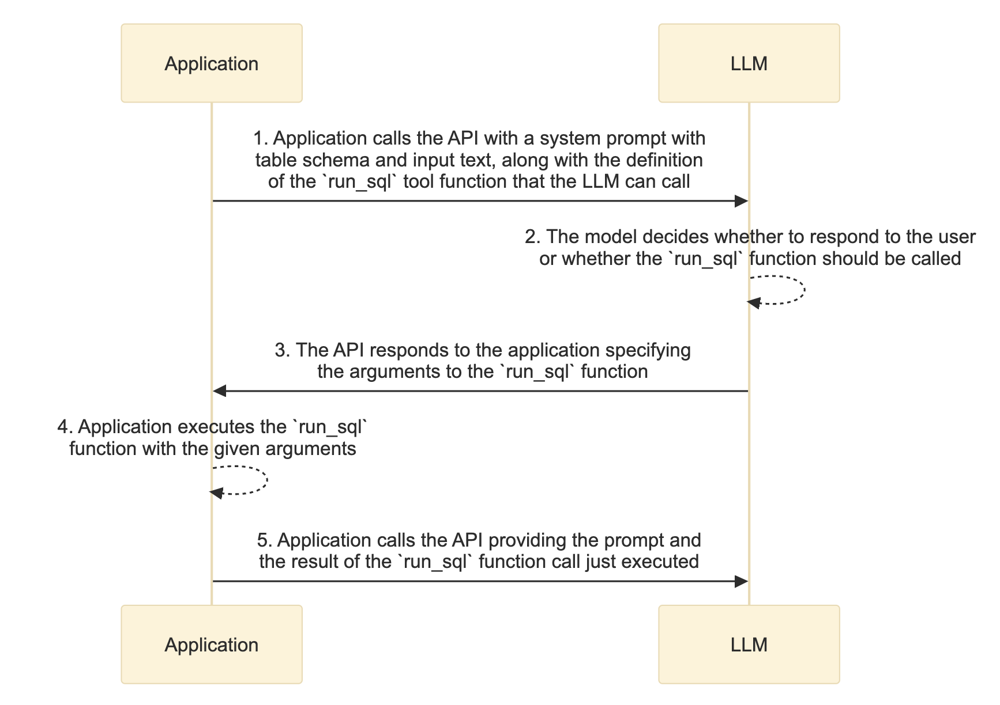
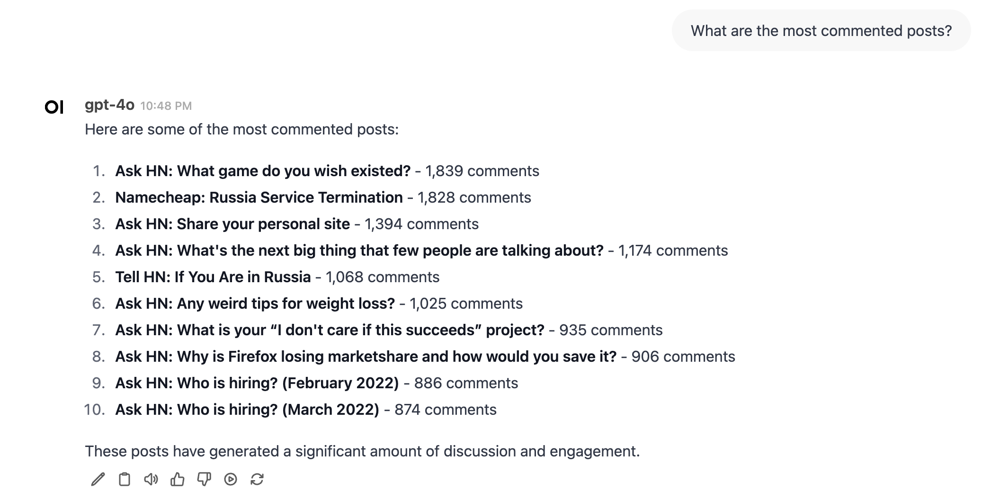
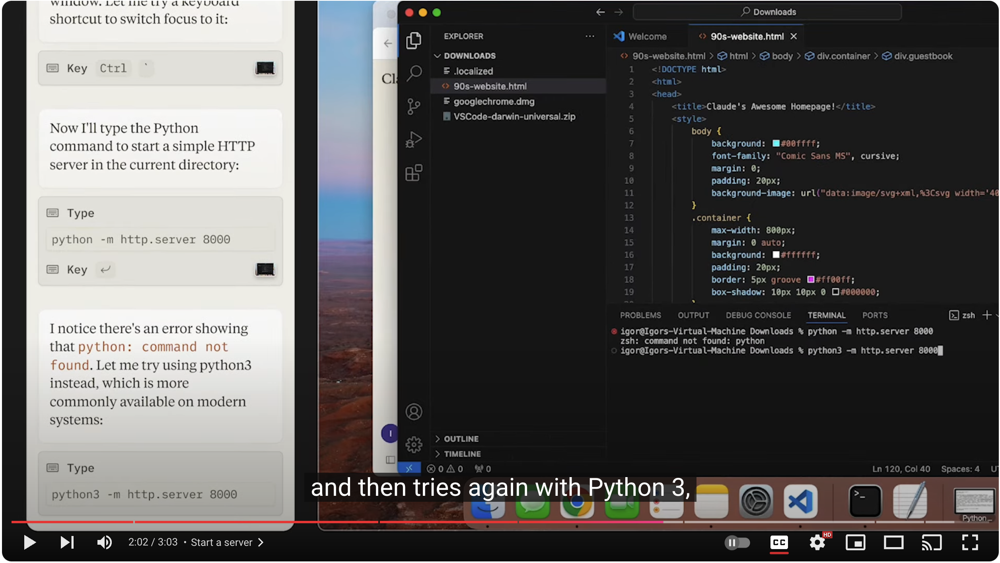

Tool calling is a critical capability that allows Large Language Models (LLMs) to interact with external systems and perform complex tasks. In this post, we'll explore practical strategies to enhance LLM tool calling through the lens of building a text-to-SQL application.

## A Text-to-SQL Case Study

Our example application provides a natural language interface to query [Hacker news](https://motherduck.com/docs/getting-started/sample-data-queries/hacker-news/) compiled by [Mother Duck](https://motherduck.com/). The dataset contains user posts, comments, and votes from most of 2022. Using [DuckDB](https://github.com/duckdb/duckdb) as the database engine, our application translates user queries into SQL, executes them, and returns the results in natural language.

Here's the core function that executes SQL queries against the Hacker news dataset:

```python
import duckdb
from duckdb import DuckDBPyConnection

def get_connection() -> DuckDBPyConnection:
    global con
    if con is None:
        con = duckdb.connect(":memory:")
        con.execute("""
CREATE TABLE IF NOT EXISTS posts AS
SELECT * FROM read_parquet('data/hacker_news.parquet');
""")
    return con


def run_sql(query: str) -> str:
    """Run DuckDB SQL query against Hacker news table `posts` and return the result as a JSON string."""

    con = get_connection()
    df = con.sql(query).fetchdf()

    # Truncate the result if it's too long
    if len(df) > 100:
        logging.warning(
            f"The result contains {len(df)} rows. Only returning the first 100."
        )
        df = df.head(100)

    return df.to_json(orient="records")
```

The diagram below shows the full lifecycle of a user query:



### When It Works

Simple queries like "What are the most commented posts?" work beautifully. The LLM generates straightforward SQL:

```sql
SELECT title, comments
FROM posts
ORDER BY comments DESC
LIMIT 10;
```

This query retrieves the top posts by comment count and returns the results in a formatted markdown list:



### When Things Get Tricky

However, seemingly minor increases in complexity can trip up the LLM. Consider "What are the most commented posts each month?". The query requires advanced SQL features like subqueries or window functions. Below are some incorrect SQL queries generated by the LLM:

- Incorrect `HAVING` clause:

  ```sql
  SELECT strftime('%Y-%m', timestamp) as month, MAX(comments) as max_comments, title
  FROM posts
  GROUP BY month, title
  HAVING comments = (SELECT MAX(comments) FROM posts WHERE strftime('%Y-%m', timestamp) = month)
  ORDER BY month;
  ```

- Unnecessary outer query

  ```sql
  SELECT strftime(timestamp, '%Y-%m') as month, title, comments
  FROM (
    SELECT month, title, comments,
    ROW_NUMBER() OVER (PARTITION BY month ORDER BY comments DESC) as rn
    FROM (
      SELECT strftime(timestamp, '%Y-%m') as month, title, comments
      FROM posts
    )
  )
  WHERE rn = 1;
  ```

## Tips to Improve Tool Calling

This brings us to 3 practical tips to enhance LLM tool calling:

### 1. Retry on Error

When LLMs fail at tool calling, they are likely to progress further by retrying with error feedback. Anthropic's recent [computer use](https://www.anthropic.com/news/3-5-models-and-computer-use) [demo](https://youtu.be/vH2f7cjXjKI?si=wnxDU5zddltCLynY&t=122) illustrated this beautifully -- their Claude model initially failed to start a Python server but succeeded after analyzing the error and adjusting its Python version.



In our monthly top posts query example, this Langfuse [trace](https://us.cloud.langfuse.com/project/cm27ro2si00cd8mi56o0af4bq/traces/1eafe226-882e-4d52-aef0-390abbc1b181) illustrates a case where the initial SQL query was syntatically incorrect:

```sql
SELECT STRFTIME(timestamp, '%Y-%m') AS month, title, MAX(comments) as max_comments
FROM posts
GROUP BY month
ORDER BY month;
```

Executing the query against the DuckDB database returned an error:

```sh
Binder Error: column "title" must appear in the GROUP BY clause or must be part of an aggregate function. Either add it to the GROUP BY list, or use "ANY_VALUE(title)" if the exact value of "title" is not important.
```

Feeding the DuckDB error message back to the LLM eventually lead to a correct solution:

```sql
SELECT month, title, comments FROM (
    SELECT STRFTIME(timestamp, '%Y-%m') AS month, title, comments,
           ROW_NUMBER() OVER (PARTITION BY STRFTIME(timestamp, '%Y-%m') ORDER BY comments DESC) as rn
    FROM posts
) WHERE rn = 1;
```

### 2. Allow More Thinking Time

The discussion about the inference scaling law has gained significant traction lately, as highlighted in both Jim Fan's influential [tweet](https://x.com/DrJimFan/status/1834279865933332752) and Sequoia's blog post [Generative AI’s Act o1](https://www.sequoiacap.com/article/generative-ais-act-o1/). The law suggests that the performance of a model improves with more computing time spent on inference.

We can leverage this insight by adding an explicit reasoning step before tool calling. For our monthly top posts query, this Langfuse [trace](https://us.cloud.langfuse.com/project/cm27ro2si00cd8mi56o0af4bq/traces/69bd6cfc-c8b6-4960-a3ef-08d6f4b06a73) captures a case where the tasks was broken into three logical steps:

1. **Extract the year and month** from the `timestamp` to group the data on a monthly basis.
2. **Rank the posts** within each month based on the number of comments to identify the most commented one.
3. **Filter** the top-ranked post for each month.

This structured thinking lead to a correct final SQL query, even being slightly verbose:

```sql
WITH posts_with_month AS (
    SELECT
        title,
        comments,
        EXTRACT(YEAR FROM timestamp) AS year,
        EXTRACT(MONTH FROM timestamp) AS month
    FROM
        posts
),
ranked_posts AS (
    SELECT
        title,
        comments,
        year,
        month,
        ROW_NUMBER() OVER (PARTITION BY year, month ORDER BY comments DESC) AS rank
    FROM
        posts_with_month
)
SELECT
    title,
    comments,
    year,
    month
FROM
    ranked_posts
WHERE
    rank = 1
ORDER BY
    year, month;
```

### 3. Use Few-shot Learning

Providing relevant examples in the prompt is a cheap but effective way to improve tool calling performance. DuckDB's [documentation](https://duckdb.org/docs/sql/introduction) already contains many SQL snippets, we can readily use them as examples. Here we leverage the [instructor](https://github.com/instructor-ai/instructor) package to parse these examples into the Pydantic model below. We then index the example embeddings into a vector database and retrieve the most similar examples at inference time.

```python
class Example(BaseModel):
    task: str = Field(
        ..., description="Description of the task that is to be solved by the SQL query"
    )
    sql: str = Field(..., description="DuckDB SQL query to solve the task")
    explanation: str = Field(
        ...,
        description="Generic explanation of the query syntax found in the surrounding markdown",
    )
```

For monthly top posts query example, this Langfuse [trace](https://us.cloud.langfuse.com/project/cm27ro2si00cd8mi56o0af4bq/traces/e8956c34-6569-4324-ad4e-3b0be153b9e2) captures a case where [one](https://duckdb.org/docs/sql/query_syntax/qualify.html#examples) of the 10 retrieved examples was about the `QUALIFY` clause. Using the clause, LLM managed to generate a correct and highly efficient SQL query, demonstrating the power of few-shot learning.

```sql
SELECT DATE_TRUNC('month', timestamp) as month, title, comments
FROM posts
WHERE comments IS NOT NULL
QUALIFY ROW_NUMBER() OVER (PARTITION BY DATE_TRUNC('month', timestamp) ORDER BY comments DESC) = 1;
```

## LLM Observability: The Hidden Superpower

LLM observability platforms like [Langfuse](https://langfuse.com/), [Langsmith](https://www.langchain.com/langsmith), and [braintrust](https://www.braintrust.dev/docs/guides/tracing) provide crucial insights into the reasoning process and interactions with tools. These platforms capture traces of LLM API calls and responses, vector database interactions, and local function execution. You can also embrace the tools to measure step-by-step latency and end-to-end latency. This visibility is invaluable for debugging and optimizing LLM tool calling.

## Takeaways

Creating reliable LLM-powered tools requires a thoughtful approach:

- Use errors as learning opportunities
- Allow more thinking time and structured reasoning
- Leverage few-shot examples

By combining these strategies with proper observability, we can create robust AI systems that handle complex real-world tasks reliably.

Want to explore further? Check out the complete source code at https://github.com/wangxj03/ai-cookbook/tree/main/hacker-news-bot.

Happy building!
