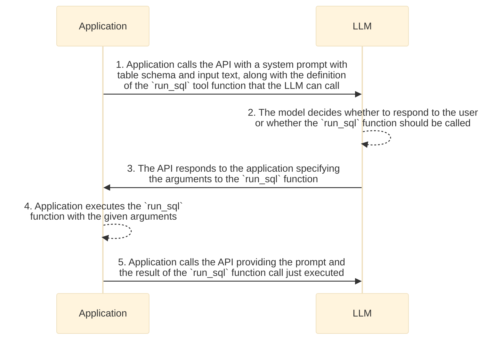

```mermaid
---
config:
  theme: base
---
sequenceDiagram
    participant Application
    participant LLM

    Application->>LLM: 1. Application calls the API with a system prompt with<br/>table schema and input text, along with the definition<br/>of the `run_sql` tool function that the LLM can call

    LLM-->>LLM: 2. The model decides whether to respond to the user<br/> or whether the `run_sql` function should be called

    LLM->>Application: 3. The API responds to the application specifying<br/>the arguments to the `run_sql` function

    Application-->>Application: 4. Application executes the `run_sql`<br/>function with the given arguments

    Application->>LLM: 5. Application calls the API providing the prompt and<br/>the result of the `run_sql` function call just executed
```
